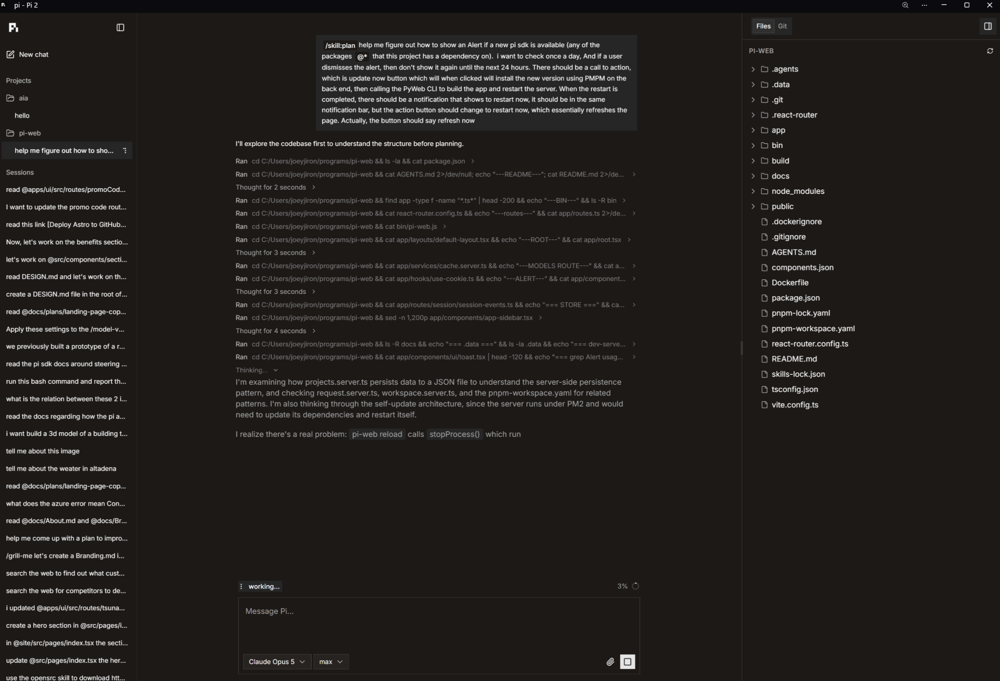

# Pi Web

Pi Web lets you use the Pi Coding SDK through a web interface. It aims for near parity with the TUI application, but intentionally leaves out a few things I do not use.

I built this as a personal project and am putting it out there for you to fork and use however you want, with no guarantees.



## Why a web interface?

I prefer using Pi through a web interface because I can control it remotely from my phone without installing an extra app. My setup uses a Tailscale VPN, which lets me access my server from anywhere.

The interface looks and behaves somewhat like ChatGPT or Claude Desktop. The difference is that, instead of installing a desktop app, you run Pi Web as a simple Node.js server like any other project.

## How it works

Pi Web is a full-stack application. It uses React Router in framework mode to render pages and handle all back-end processing.

It uses the credentials and configuration from the Pi CLI, so you must configure the CLI before running the server.

Pi Web also comes with its own CLI. Run it with the help option to see the available commands and options.

## Staying up to date

Pi Web checks once a day for a newer Pi SDK and tells you about it in two places.

In the terminal, `pi-web install`, `start`, `restart` and `reload` offer to update before they run:

```
Pi SDK update available: 0.85.1 -> 0.99.2
Update now? [y/N]
```

Answer no and you will not be asked again until the next day. `pi-web status` and `pi-web doctor` mention it without asking, and never hit the network.

You can also check whenever you like:

```sh
pi-web update           # check, confirm, install, rebuild, restart
pi-web update --check   # report what is available, change nothing
pi-web update --yes     # skip the confirmation
```

In the browser, a toast shows the same thing with the command to run. Dismiss it and it stays quiet until the next day.

An update stops the server, runs `pnpm add` for every `@earendil-works/*` package at the same version, rebuilds, and starts it again. If the install or the build fails, `package.json`, `pnpm-lock.yaml` and the previous `build/` are all restored and the server comes back on the old version.

A successful update changes `package.json` and `pnpm-lock.yaml`, so commit them when you are happy. To go back:

```sh
git checkout package.json pnpm-lock.yaml && pnpm install && pi-web reload
```

The `pi-web` command comes from the `bin` entry in `package.json`. Run `pnpm link --global` once in the project to get it on your PATH.

## Security

Pi Web is not meant to be deployed to or accessed through the public internet. It is designed to run locally on your machine and only be accessed by devices on your private network, such as through your LAN or a VPN.

If you expose it to the public internet, you will need to add your own authentication and authorization. Even with those protections, doing so can be a serious security risk. Pi Web runs a coding agent that can execute commands on your computer, which means it may be able to read files, change code, install software, or perform almost any other action available to your user account.

I did not build permission handling or restrictions into this project because I personally do not use them for my agent harnesses. If you need approval prompts, command restrictions, filesystem limits, or other safeguards, you will need to build those protections yourself.
